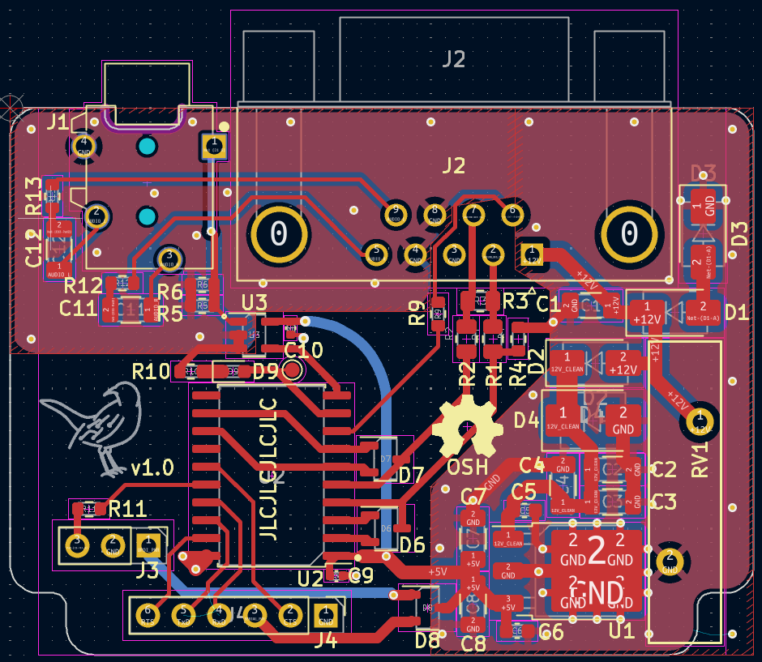
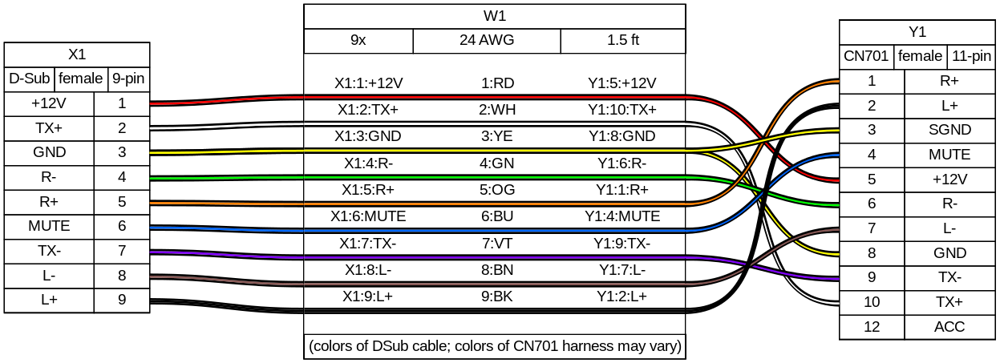

# AVCLAN Mockingboard

This board adds an auxiliary audio input to the stock head unit of compatible Toyota vehicles using a Microchip ATtiny3216 to emulate a CD changer. The Mockingboard communicates with the head unit on the AVC-LAN bus, Toyota's name for their messaging protocol over the NEC (now Renesas) IEBus.

# Project status:

The circuit board and firmware is functional and can send/recieve messages on the AVC-LAN bus. The AVC-LAN driver is incomplete and doesn't finish the initial "handshake"/advertisement, but manually sending the CD changer activation command ('p' on the serial "REPL") is effective in enabling the CD changer audio inputs (this state persists between car trips, although loss of power (dead/disconnected battery) will reset the head unit). The semi-working state of the project is functional enough for me to live with for now; although I plan on eventually coming back to this.

## (Upcoming) Features

- [ ] AVCLAN communication uses PWM peripherals for sending and receiving
    - The sending PWM (TCD) is unique to the tinyAVR 1-series, and allows queuing 2 bits at a time for sending on the AVC-Lan bus. Technically this still qualifies as ["bit-banging"](https://en.wikipedia.org/wiki/Bit_banging), but should be more robust and exhibit lower timing jitter (than previous method of manually toggling pin outputs and busy-waiting for timer counters; and not that the timing jitter was a problem). 
    - The receiving timer (TCB) precisely (again, probably more precisely than really needed) measures pulse-widths to distinguish bits.
- [ ] Hardware designed with a headset (TRRS) jack allows triggering media play/pause/skip using the head-unit buttons

## Roadmap

- [ ] Refactor (simplify) existing AVC LAN framework
- [ ] Switch AVC-LAN Tx to TCD PWM
- [ ] Media play/pause/skip feature
    - ~~Listen to head-unit for head unit on/off and skip~~
        - Use "MUTE" logic signal from head-unit
    - Test MIC_CONTROL short duration and double "click" separation
- [ ] Switch UART library?
    - https://github.com/jnk0le/AVR-UART-lib
        - (Needs updating/extension for tinyAVR 1-series)
- Speculative:
    - Bodge ADC pin to mic to try plug-detection
    - Bluetooth audio somehow?
        - ESP32 and an I2S audio codec?

# Helpful links/prior art:

- IEBus/AVCLAN decoder and message dumps (inc. a CD changer) for Sigrok
    - https://github.com/sigrokproject/sigrok-test/pull/22
    - https://github.com/sigrokproject/sigrok-dumps/pull/43
    - https://github.com/sigrokproject/libsigrokdecode/pull/106
- 

# Current Issues:

- CD changer emulation isn't working
    - Mockingboard isn't sending correct responses to finish the initial "handshake"/advertisement
- Messages get missed when logging/printing via serial (even when printing raw binary messages)
    - jnk0le UART lib doesn't support AVR 1-series
        - TODO: Add support
    - ~~Write binary parser on computer side which outputs messages in libpcap format to stdout~~
- Register functions aren't working
    - ~~Write packet dissector for Wireshark to reverse engineer more of the protocol~~

# Hardware

I ordered the boards partially assembled from JLCPCB (to keep costs down, I ordered and soldered some non-standard/stocked parts myself.)

The non-populated/assembled BOM is:

| Mouser #:           | Mfr. #:          | Desc.:                                                                                                       | Order Qty. | Unit Price (USD) |
| ------------------- | ---------------- | ------------------------------------------------------------------------------------------------------------ | ---------- | ----------- |
| 579-ATTINY3216-SNR  | ATTINY3216-SNR   | 8-bit Microcontrollers - MCU 8-bit Microcontrollers - MCU 20MHz, 32KB, SOIC20, Ind 105C, Green, T&R          | 1          | $1.27       |
| 523-L717SDE09PA4CH4 | L717SDE09PA4CH4F | D-Sub Standard Connectors D-Sub Standard Connectors D SUB R/A                                                | 1          | $1.98       |
| 490-SJ-43514        | SJ-43514         | Phone Connectors Phone Connectors audio jack, 3.5 mm, rt, 4 conductor, through hole, 0 switches              | 1          | $1.35       |
| 667-ERZ-V20D220     | ERZ-V20D220      | Varistors Varistors 22V 2000A ZNR SUR ABSORBER 20MM                                                          | 1          | $1.24       |
| 538-22-28-8093      | 22-28-8093       | Headers & Wire Housings Headers & Wire Housings 2.54MM BREAKAWAY RA 9 CKT Gold                               | 2          | $0.76       |
| 865-XC6701D502JR-G  | XC6701D502JR-G   | LDO Voltage Regulators LDO Voltage Regulators 28V High Speed Voltage Regulator                               | 1          | $1.36       |
| 563-EXN-23350-BK    | EXN-23350-BK     | Enclosures, Boxes, & Cases Enclosures, Boxes, & Cases Extruded Aluminum Enclosure Black (1.4 X 2.7 X 1.9 In) | 1          | $14.40      |

An earlier version of the board* lacked cutouts in the corners to fit the ends of the intended housing, so I haven't used the listed enclosure (yet).

*Only version of the board I have ordered so far.

## Cable harness

I ordered a [cable harness](https://www.amazon.com/dp/B01EUZ8CFU) from Amazon to acquire the head-unit side connector. I then cut the male end off a DB9 cable and connected the wires according to the following cable harness diagram:

# Firmware

### Building

#### With VS Code:

1. Install VS Code and Docker
    - Required extensions: Dev Containers
2. Open repo in VS code and wait for notification asking to re-open in dev container.
    - Wait for container to build and extensions to install
3. Select CMake build configuration
4. Start developing!

#### Natively/without VS Code Dev Containers
1. Install avr-gcc >= v8.3, binutils >= v2.39, cmake >= v3.24
2. Configure cmake in repo with `cmake -B build`
    - Trigger builds with `cmake --build build`
3. Start developing!

### Flashing

The CMake target `upload_mockingboard` uses the AVRDude utility using the "serialupdi" programmer type. I use a [USB => Serial converter](https://www.adafruit.com/product/5335) with the Rx and Tx lines connected, using one of the options described [by SpenceKonde here](https://github.com/SpenceKonde/AVR-Guidance/blob/master/UPDI/jtag2updi.md).

# Protocol reverse-engineering

The "scripts/packet-analysis" folder contains a [Wireshark](https://www.wireshark.org/) [Lua plugin](https://www.wireshark.org/docs/wsdg_html_chunked/wsluarm.html) that defines a dissector for IEBUS and AVC-LAN messages. Also contained in that folder is a [Julia](https://julialang.org/) script that pipes packets from the Mockingboard serial into Wireshark for live capturing and inspection.
    
# License

The firmware for this project is licensed under the [GNU GPLv3](https://www.gnu.org/licenses/gpl-3.0.html),
and the hardware is licensed under the [Solderpad Hardware License v2.1](http://solderpad.org/licenses/SHL-2.1/), a
wraparound license to the [Apache License 2.0](https://apache.org/licenses/LICENSE-2.0.txt).

