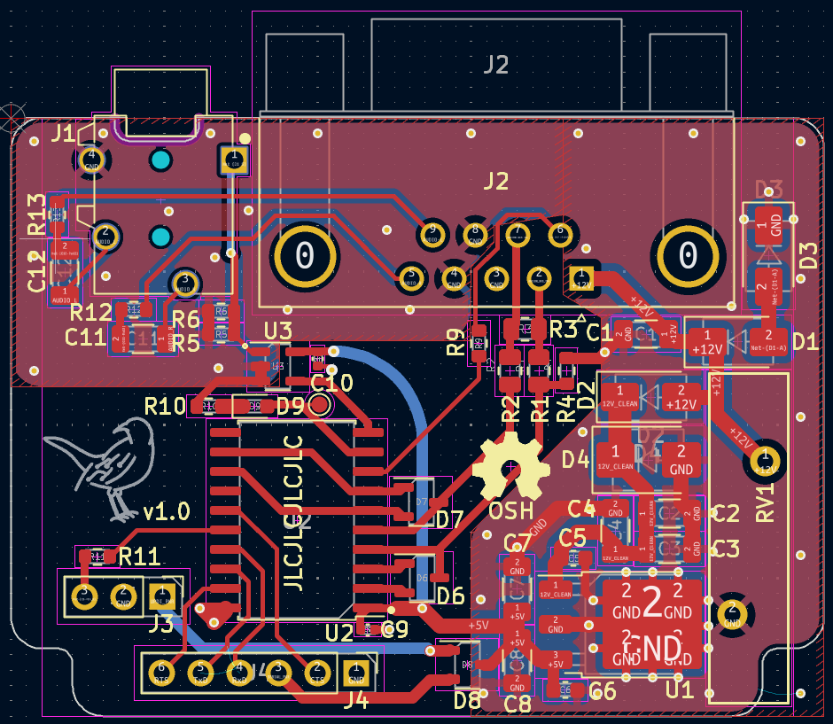
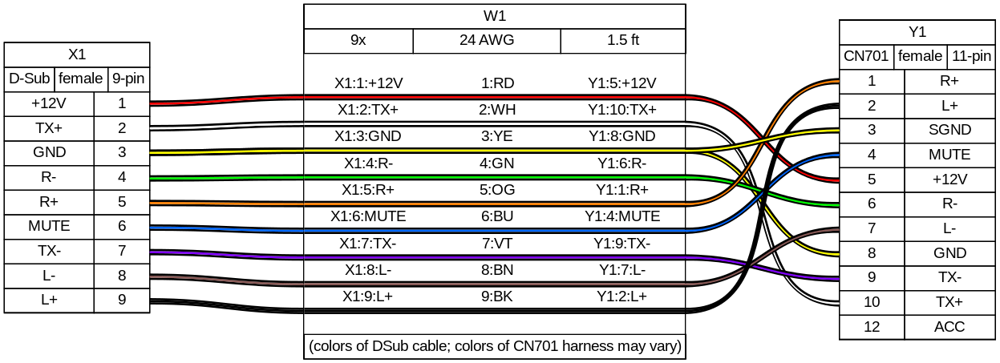

# AVCLAN Mockingboard

This project adds an aux in to the stock head unit of compatible Toyota vehicles by emulating an external CD changer. The Mockingboard communicates with the head unit over the AVC-LAN bus, Toyota's name for their messaging protocol over the NEC (now Renesas) IEBus. Also included is a Wireshark dissector for IEBus and AVC-LAN. AVC-LAN is sparsely documented publicly; this dissector collects what's known from prior art alongside my own findings.

# Features:

- Select/switch between internal CD player and mockingboard by pressing the "CD" button (repeated presses toggle between internal and external CD players)
- Generally complete handling of physical interface (track next/prev, fast-forward/rewind, track/disk repeat and random; "scan" button and change disc buttons are currently unimplemented for lack of use/purpose)
- Play/pause, next/prev control of connected phones via headset functions (mimicing the button press on a wired headset; requires phone support and connection using a TRRS aux cable)

## Future plans (Mockingboard v2)

- Bluetooth functionality
  - "Scan" button repurposed to enter bluetooth pairing mode
  - Button actions (play/pause, track skip, ff/rw, \[disc\] repeat/shuffle) mapped to AVRCP
  - Song info/status (time, etc) relayed to head-unit (i.e. time display matches actual song/audio time)
- Redesign hardware based on RPi Pico 2W (RP2350 + Bluetooth)
  - PIO used to implement:
    - AVCLAN comms
    - I2S audio
  - Dual audio input options (aux in, bluetooth)
    - Switched audio jack to sense aux plug presence
  - Audio codec with differential output (better rejection of electrical noise, e.g. from adjacent AVCLAN bus lines)
  - Switching regulator (easier assembly)
  - CAN transceiver
    - TX/RX connected to different diodes (or different pads of a single dual/multicolor LED package) for observability

# Helpful links/prior art:

- IEBus/AVCLAN decoder and message dumps (inc. a CD changer) for Sigrok
    - https://github.com/sigrokproject/sigrok-test/pull/22
    - https://github.com/sigrokproject/sigrok-dumps/pull/43
    - https://github.com/sigrokproject/libsigrokdecode/pull/106
- https://web.archive.org/web/20230319000356/http://softservice.com.pl/corolla/avc/avclan.php
- https://web.archive.org/web/20040617005106/http://www.interfacebus.com/Design_Connector_IEbus.html
- https://web.archive.org/web/2/https://old.pinouts.ru/Car-Stereo-Toyota-Lexus/Toyota_1990-2002_CD_Chang_pinout.shtml
- https://web.archive.org/web/20240519043021/https://pop.fsck.pl/hardware/toyota-corolla.html
- https://github.com/GadgetNutt/AVC-LAN-Module-Builder

# Hardware

I ordered the boards partially assembled from JLCPCB (to keep costs down, I ordered and soldered some non-standard/stocked parts myself.)

The non-populated/assembled BOM is:

| Mouser #:           | Mfr. #:          | Desc.:                                                                                                       | Order Qty. | Unit Price (USD) |
| ------------------- | ---------------- | ------------------------------------------------------------------------------------------------------------ | ---------- | ----------- |
| 579-ATTINY3216-SNR  | ATTINY3216-SNR   | 8-bit Microcontrollers - MCU 8-bit Microcontrollers - MCU 20MHz, 32KB, SOIC20, Ind 105C, Green, T&R          | 1          | $1.27       |
| 523-L717SDE09PA4CH4 | L717SDE09PA4CH4F | D-Sub Standard Connectors D-Sub Standard Connectors D SUB R/A                                                | 1          | $1.98       |
| 490-SJ-43514        | SJ-43514         | Phone Connectors Phone Connectors audio jack, 3.5 mm, rt, 4 conductor, through hole, 0 switches              | 1          | $1.35       |
| 667-ERZ-V20D220     | ERZ-V20D220      | Varistors Varistors 22V 2000A ZNR SUR ABSORBER 20MM                                                          | 1          | $1.24       |
| 538-22-28-8093      | 22-28-8093       | Headers & Wire Housings Headers & Wire Housings 2.54MM BREAKAWAY RA 9 CKT Gold                               | 2          | $0.76       |
| 865-XC6701D502JR-G  | XC6701D502JR-G   | LDO Voltage Regulators LDO Voltage Regulators 28V High Speed Voltage Regulator                               | 1          | $1.36       |
| 563-EXN-23350-BK    | EXN-23350-BK     | Enclosures, Boxes, & Cases Enclosures, Boxes, & Cases Extruded Aluminum Enclosure Black (1.4 X 2.7 X 1.9 In) | 1          | $14.40      |

An earlier version of the board* lacked cutouts in the corners to fit the ends of the intended housing, so I haven't used the listed enclosure (yet).

*Only version of the board I have ordered so far.

## Cable harness

I ordered a [cable harness](https://www.amazon.com/dp/B01EUZ8CFU) from Amazon to acquire the head-unit side connector. I then cut the male end off a DB9 cable and connected the wires according to the following cable harness diagram:

# Firmware

### Building

#### With VS Code:

1. Install VS Code and Docker
    - Required extensions: Dev Containers
2. Open repo in VS code and wait for notification asking to re-open in dev container.
    - Wait for container to build and extensions to install
3. Select CMake build configuration
4. Start developing!

#### Natively/without VS Code Dev Containers
1. Install avr-gcc >= v13.1, binutils >= v2.39, cmake >= v3.24
2. Configure cmake with a hardware-target preset, e.g. `cmake --preset attiny3216-debug-usb0`
    (the preset selects the AVR cross-compile toolchain; `cmake --list-presets` shows the rest)
    - Trigger builds with `cmake --build build`
3. Start developing!

### Flashing

The CMake target `flash` uses the AVRDude utility using the "serialupdi" programmer type. I use a [USB => Serial converter](https://www.adafruit.com/product/5335) with the Rx and Tx lines connected, using one of the options described [by SpenceKonde here](https://github.com/SpenceKonde/AVR-Guidance/blob/master/UPDI/jtag2updi.md).

# Protocol reverse-engineering

The "scripts/packet-analysis" folder contains a [Wireshark](https://www.wireshark.org/) [Lua plugin](https://www.wireshark.org/docs/wsdg_html_chunked/wsluarm.html) that defines a dissector for IEBUS and AVC-LAN messages.

# License

The firmware for this project is licensed under the [GNU GPLv3](https://www.gnu.org/licenses/gpl-3.0.html),
and the hardware is licensed under the [Solderpad Hardware License v2.1](http://solderpad.org/licenses/SHL-2.1/), a
wraparound license to the [Apache License 2.0](https://apache.org/licenses/LICENSE-2.0.txt).

